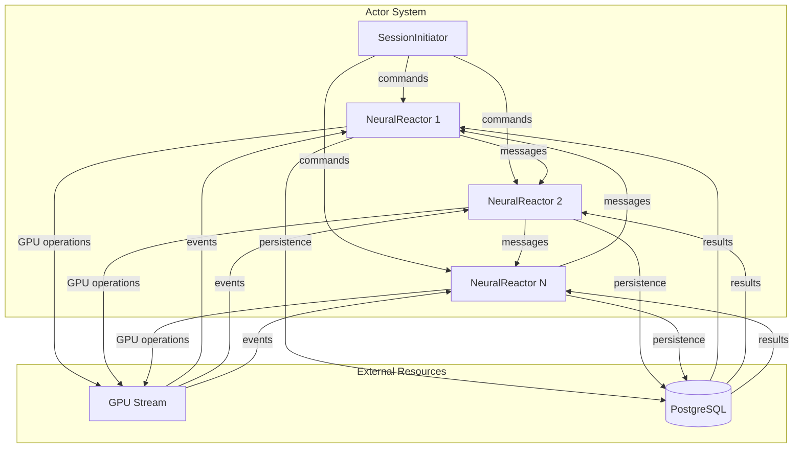
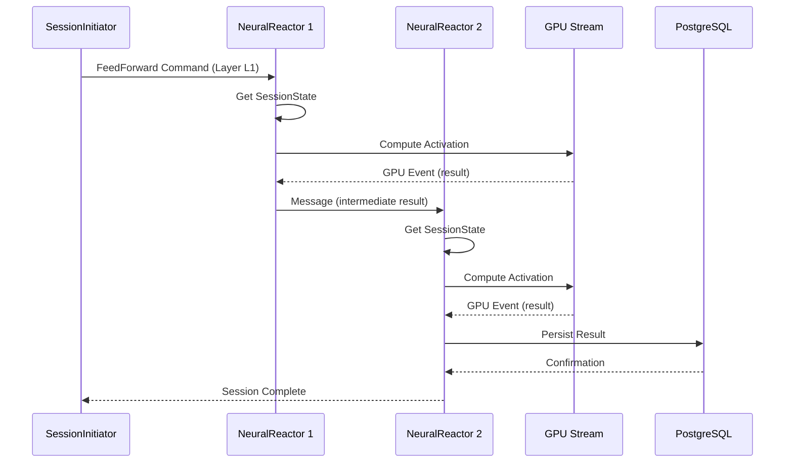
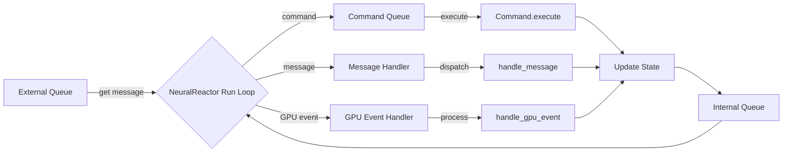
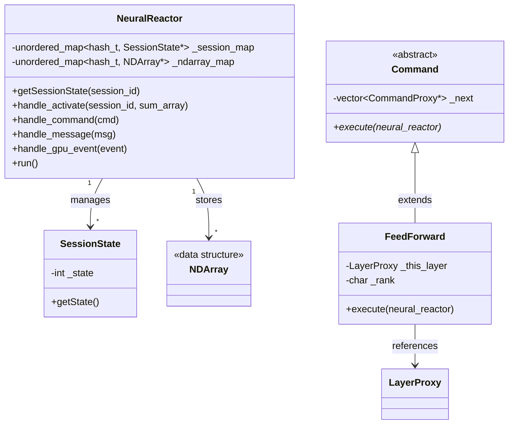
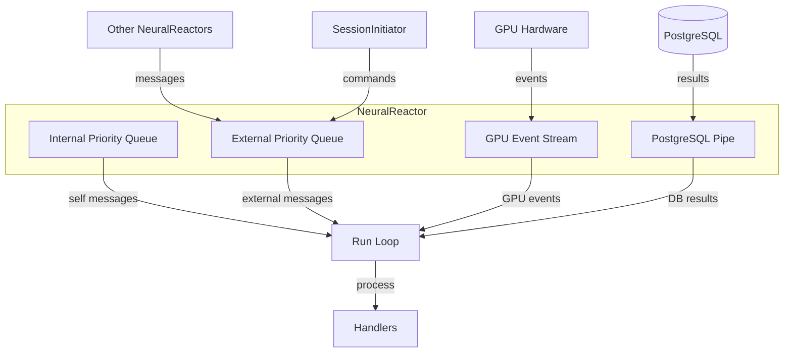
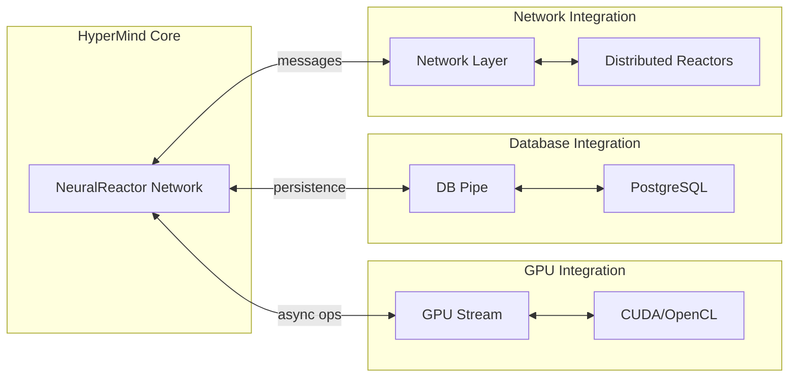
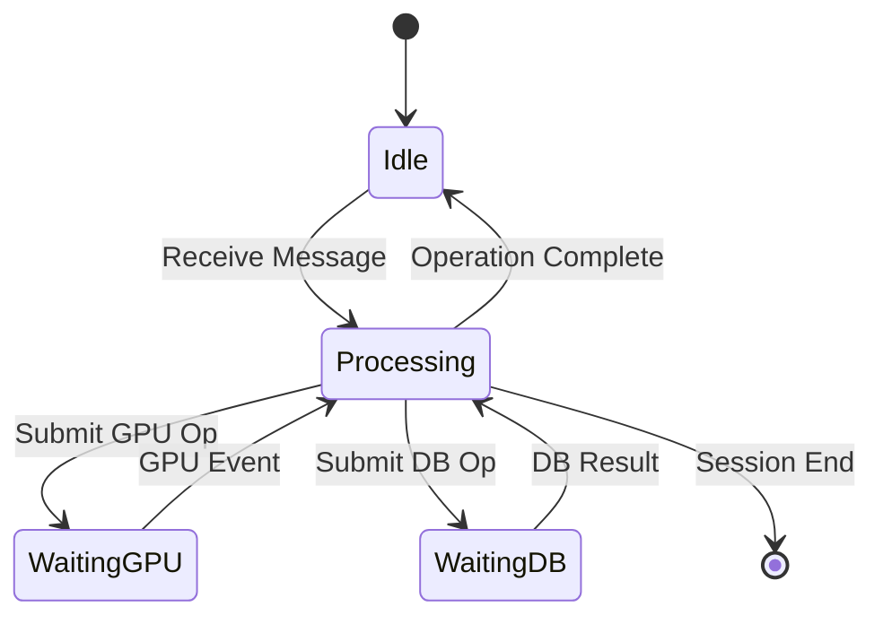
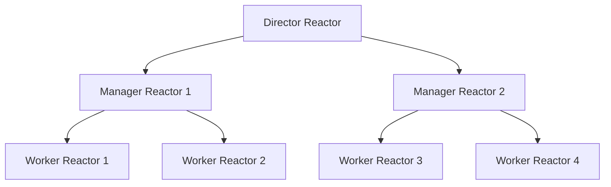

# HyperMind Architecture Overview

## Introduction

HyperMind is a distributed neural network framework designed for asynchronous, actor-based neural computation. The system leverages a reactive architecture with multiple concurrent processing streams including CPU threads, GPU streams, and database connections.

## Technology Stack

- **Language**: C++
- **Architecture Pattern**: Actor Model with Reactive Streams
- **Concurrency Model**: Multi-threaded with asynchronous message passing
- **Hardware Integration**: GPU acceleration, PostgreSQL persistence
- **Core Paradigm**: Command-Query Responsibility Segregation (CQRS) with Event-Driven Architecture

## System Architecture

### High-Level Component Diagram

### Component Descriptions

#### 1. SessionInitiator (ThreadActor)
- **Purpose**: Orchestrates neural network computation sessions
- **Responsibilities**:
  - Initiates feedforward passes through network layers
  - Manages session lifecycle
  - Distributes work to NeuralReactors

#### 2. NeuralReactor (ThreadActor)
- **Purpose**: Core computational unit handling neural network operations
- **Responsibilities**:
  - Process commands and messages asynchronously
  - Manage session state
  - Coordinate GPU operations
  - Handle database persistence
  - Implement map-reduce patterns for distributed computation

#### 3. Command System
- **Purpose**: Encapsulate asynchronous operations
- **Types**:
  - `FeedForward`: Neural network forward pass computation
  - Additional commands (extensible design)
- **Pattern**: Command pattern with proxy-based chaining

#### 4. LayerProxy
- **Purpose**: Reference and manage neural network layers
- **Responsibilities**: Layer abstraction for distributed computation

## Data Flow Architecture

### Neural Network Computation Flow

### Message Processing Flow

## System State Management

### State Hierarchy

## Queue Architecture

### Three-Queue System per NeuralReactor

### Queue Priority System

1. **Internal Queue**: Self-scheduled operations, highest priority
2. **External Queue**: Messages from other actors
3. **GPU Stream**: Asynchronous GPU computation results
4. **PostgreSQL Pipe**: Database operation results

## Integration Boundaries

### External System Integrations

## Concurrency Model

### Actor-Based Concurrency

- Each `NeuralReactor` is an independent thread actor
- Message passing ensures thread safety
- No shared mutable state between actors
- Lock-free communication via queues

### Asynchronous Operation Model

## Hierarchical Processing Ranks

The system implements a three-tier hierarchy for distributed neural computation:

1. **Worker**: Executes basic layer computations
2. **Manager**: Coordinates workers for complex operations
3. **Director**: Orchestrates managers for full network passes

## Design Patterns

### 1. Actor Model
- Encapsulated state within actors
- Message-based communication
- Location transparency for distributed deployment

### 2. Command Pattern
- Commands encapsulate operations
- Proxy-based command chaining
- Asynchronous execution

### 3. Reactor Pattern
- Event-driven architecture
- Non-blocking I/O
- Multiple event sources (queues, GPU, DB)

### 4. Proxy Pattern
- `LayerProxy` provides layer indirection
- `CommandProxy` enables command chaining
- Supports lazy loading and distributed references

## Scalability Characteristics

### Horizontal Scalability
- Add more NeuralReactor instances
- Distribute across machines
- Network-transparent message passing

### Vertical Scalability
- GPU acceleration for computation
- Multiple GPU streams per reactor
- Asynchronous database operations

## Performance Considerations

### Optimization Strategies

1. **Priority Queue Management**: Critical operations processed first
2. **Non-blocking I/O**: GPU and DB operations don't block reactor
3. **Batching**: Multiple operations combined for GPU efficiency
4. **Session State Caching**: Hash map lookup for O(1) state access
5. **Command Chaining**: Reduce message overhead through proxies

### Bottleneck Mitigation

- **GPU Contention**: Dedicated stream per reactor
- **Database Contention**: Pipelined operations, async writes
- **Message Queue Overflow**: Priority-based scheduling
- **Memory Pressure**: Hash map-based state management

## Future Architecture Considerations

### Potential Enhancements

1. **Fault Tolerance**: Add supervisor actors for restart strategies
2. **Load Balancing**: Dynamic work distribution across reactors
3. **Monitoring**: Instrumentation for performance metrics
4. **Checkpointing**: Session state snapshots for recovery
5. **Dynamic Topology**: Runtime addition/removal of reactors
6. **Multi-GPU Support**: Reactor affinity to specific GPUs
7. **Distributed Database**: Shard session state across cluster

## Conclusion

HyperMind implements a sophisticated distributed neural network framework using actor-based concurrency, reactive streams, and asynchronous processing. The architecture supports high-throughput, low-latency neural computation with seamless integration to GPU and database resources.

The design emphasizes:
- **Scalability**: Horizontal and vertical scaling capabilities
- **Responsiveness**: Non-blocking, event-driven processing
- **Maintainability**: Clear separation of concerns with command pattern
- **Performance**: GPU acceleration with efficient state management
